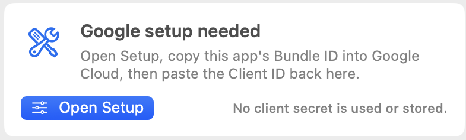
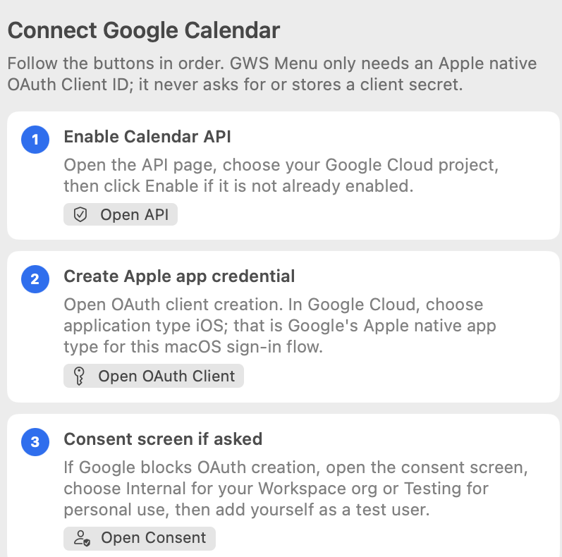
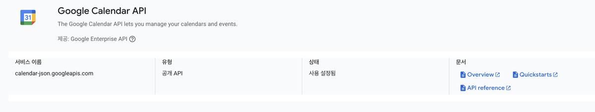
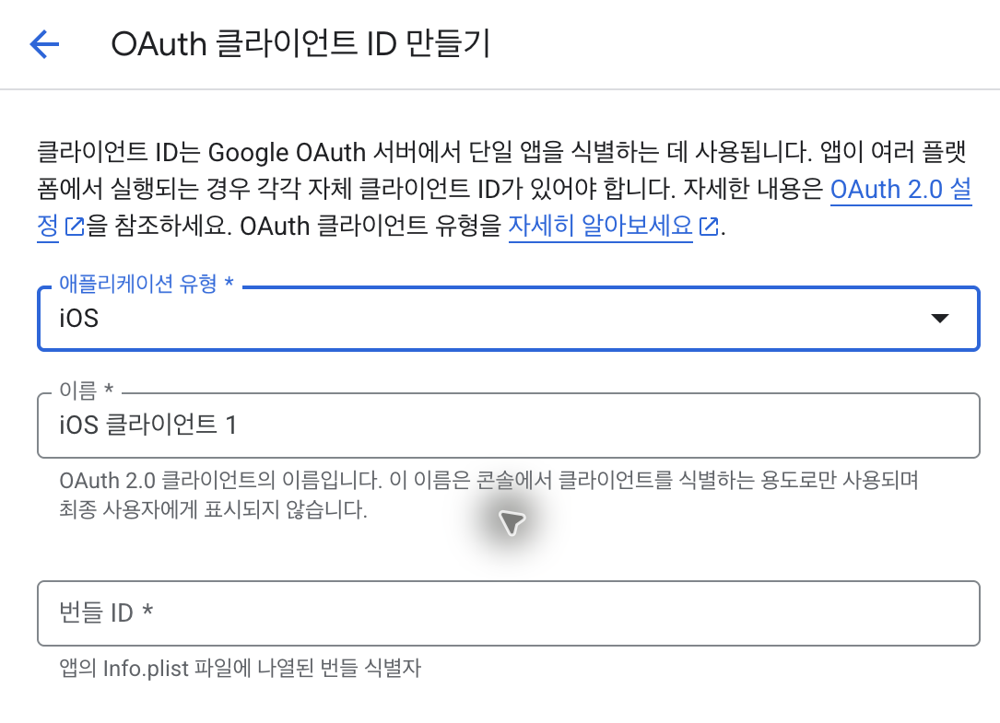

# GWS Menu

Native macOS menu bar app for Google Workspace shortcuts, read-only Google Calendar, meeting alerts, and an optional Gmail unread badge.



## What It Does

- Opens Gmail, Calendar, Meet, Chat, Drive, Docs, Sheets, Slides, and custom Google services from the menu bar.
- Shows your upcoming Google Calendar events and the current or next meeting in the menu bar.
- Sends optional macOS desktop alerts before meetings.
- Shows an optional Gmail Inbox unread badge, capped as `99+`.
- Stores Google sign-in credentials in Keychain.

## Quick Start

1. Install Xcode Command Line Tools if Swift is not available:

```bash
xcode-select --install
```

2. Clone the repository and run the installer:

```bash
git clone https://github.com/hyunn515/gws-menu-app.git
cd gws-menu-app
swift scripts/sync-google-app-icons.swift --accept-google-brand-terms
```

This command downloads Google product icons into git-ignored local resources, builds the macOS app, installs it to `~/Applications/GWSMenu.app`, and opens it.

No DMG, notarization, or paid Apple Developer account is required when you build from source.

## Connect Google

Open GWS Menu from the menu bar and click **Open Setup**.



### 1. Enable APIs

In Google Cloud Console, choose or create a project, then enable:

- **Google Calendar API**: required
- **Gmail API**: optional, only for the unread badge

If Google asks for an OAuth consent screen first, choose **Internal** for a Workspace organization or **External / Testing** for personal use, then add yourself as a test user.

Calendar API should look enabled:



### 2. Create OAuth Client

Go to **Credentials -> Create credentials -> OAuth client ID**.

Use these values:

- **Application type**: `iOS`
- **Name**: anything, for example `GWS Menu`
- **Bundle ID**: copy the Bundle ID shown in GWS Menu. The default is `io.github.gwsmenu.app`.

Google labels this as `iOS`, but it is also the correct Apple-native OAuth type for this macOS sign-in flow.
If you build with a custom `GWS_BUNDLE_ID`, use that exact value here.



After creating it, copy only the **Client ID** ending in `.apps.googleusercontent.com`.

### 3. Save and Sign In

Paste the Client ID into GWS Menu and click **Save Setup**. GWS Menu updates the local app bundle, registers the Google callback URL, restarts, and then you can click **Sign in**.

Do not use **Web application** or **Desktop app** credentials. If Google shows a `client_secret`, it is the wrong credential type. GWS Menu does not use or store a client secret.

After sign-in, GWS Menu shows a small **Finish setup** card for optional features:

- **Meeting alerts**: asks for macOS notification permission only when you enable it.
- **Gmail badge**: asks for Gmail unread-count permission only when you enable it.
- **Open at login**: adds GWS Menu to macOS Login Items.

## Settings

Open Settings from the gear button in GWS Menu. Changes save automatically.

- **Calendar**: choose desktop alert timing.
- **Mail**: enable or disable the Gmail unread badge.
- **General**: enable Open at login or open the GitHub repository.
- **Account**: sign out of Google.
- **Google setup**: reset the saved Client ID and URL scheme if you need to start over.

To customize Workspace shortcuts, click the sliders button next to the **Workspace** label on the main menu. The editor uses the same grid layout as the menu.

## Updating

Open **Settings -> General -> GitHub repository**, then update manually from the repo:

```bash
git pull
swift scripts/sync-google-app-icons.swift --accept-google-brand-terms
```

The installer closes any running `GWSMenu` process, replaces `~/Applications/GWSMenu.app`, and opens the new version.

## Privacy and Permissions

- Calendar access uses `https://www.googleapis.com/auth/calendar.readonly`.
- The Gmail badge uses `https://www.googleapis.com/auth/gmail.labels` only when enabled.
- GWS Menu does not read Gmail sender, subject, body, or attachments.
- GWS Menu does not send desktop mail alerts.
- Google auth is handled by Google Sign-In and Keychain.
- Google product icons are downloaded locally and ignored by Git.

## Troubleshooting

- **`client_secret` error**: delete that OAuth client and create an `iOS` OAuth client instead.
- **Sign-in opens and immediately closes**: open **Setup**, save the current Client ID once, then sign in again.
- **Meeting alerts do not appear**: allow GWS Menu in **System Settings -> Notifications**, then enable Meeting alerts again.
- **Old behavior after updating**: rerun the installer command; it restarts the menu app after replacing it.
- **Need icons only**:

```bash
swift scripts/sync-google-app-icons.swift --accept-google-brand-terms --no-install
```

## Development Checks

Rust is only needed for the Rust workspace checks.

```bash
cargo test
cargo fmt --check
cargo clippy --all-targets -- -D warnings
swift build --package-path macos/GWSMenuBar
```
